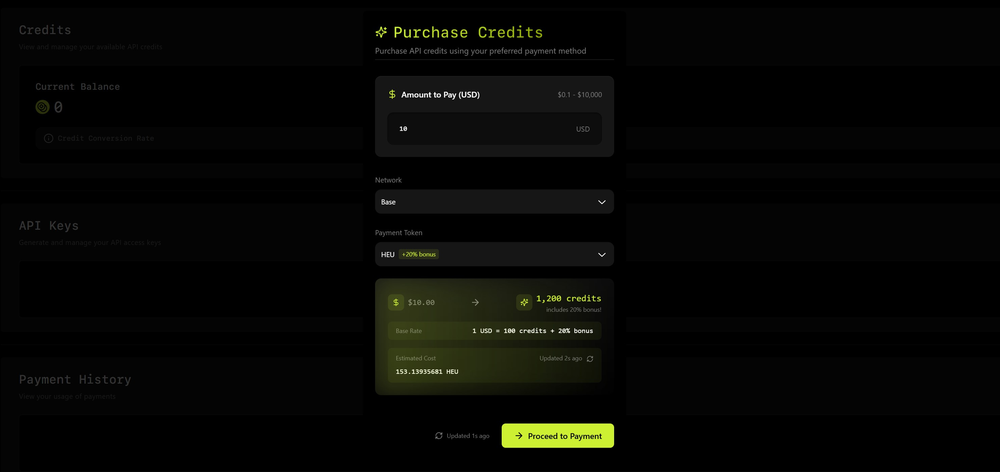

Users can purchase API credits with crypto. These credits are used to access Heurist's decentralized AI compute resources, with different API endpoints consuming credits based on their computational requirements.

* 1 USD = 100 credits
* When paying with HEU tokens, users receive a 20% bonus (120 credits per $1 equivalent)

Credits can be purchased at [heurist.ai/credits](https://heurist.ai/credits). 

### Credits Consumption

#### 1. Image Generation
Base pricing is calculated for 1024x1024 resolution with 20 iterations. Other resolutions or iteration counts are priced proportionally.

| Model | Credits per Image |
|-------|------------------|
| Stable Diffusion XL/1.5 | 0.05 |
| Stable Diffusion with LoRA | 0.1 |
| FLUX.1-dev | 0.2 |
| FLUX.1-dev with LoRA | 0.5 |

#### 2. Video Generation
| Model | Duration | Credits |
|-------|----------|----------|
| Hunyuan | 5 seconds | 25 |

#### 3. Large Language Models
LLM pricing has moved. See the consolidated table in Supported Models:

- [Supported Models → LLM Credits Table](/llm-gateway/supported-models#llm-credits-table)

#### 4. Embedding Models
Pricing is in credits per million tokens.

| Model | Input (per 1M tokens) |
|-------|----------------------|
| baaiai/bge-large-en-v1.5 | 1 |
